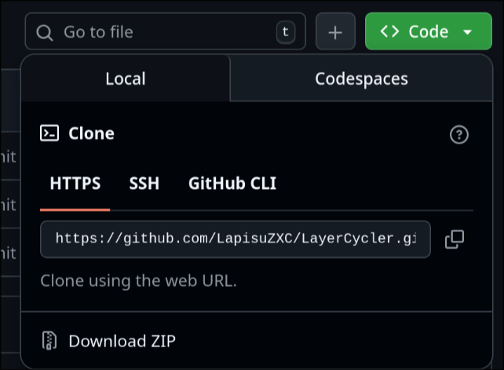
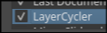
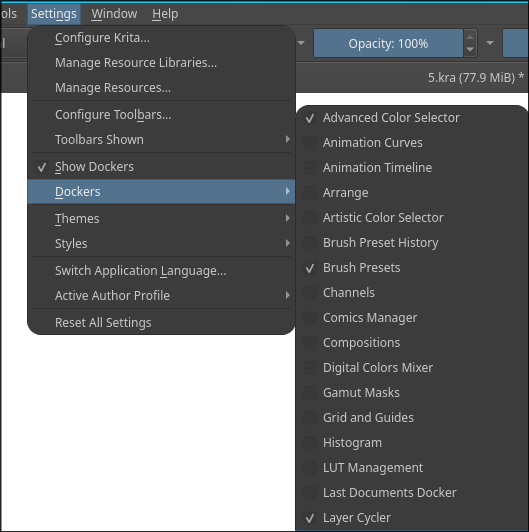

#TODO - ДОДЕЛАТЬ КНОПКИ
        ДОПИЛИТЬ ДОКИ А ТО ЩА ДЕРЬМО

# LayerCycler — плагин для Krita

**LayerCycler** — простой и понятный плагин для Krita, который помогает быстро переключаться между слоями и временно скрывать лишние слои. Плагин рассчитан на пользователей, которые не хотят копаться в настройках — всё максимально просто.

---

## Краткое описание функционала

* **Hide All but Top** — скрыть все слои, оставив видимым только самый верхний.
* **Hide All but Bottom** — скрыть все слои, оставив видимым только самый нижний (нижний по списку).
* **Move Layer Up** — переключиться на следующий слой сверху (включая видимость).
* **Move Layer Down** — переключиться на слой ниже.
* Вверху панели отображается название текущего (видимого) слоя.

---

## Для кого это подходит

Для художниц и художников, которые хотят простую панель для перебора слоёв без лишних кликов. Инструкция написана простым языком и содержит три варианта установки: ручной, через `git clone` и через `git clone` + симлинки (для удобного обновления).

---

## Поддерживаемые системы

Инструкция содержит шаги для **Windows**, **Linux** и **macOS**.

---

## Важное (не пропустить!)

После копирования файлов плагина **обязательно** включите плагин в менеджере Python-плагинов Krita и перезапустите программу:

* **English:** `Settings → Configure Krita... → Python Plugin Manager` → найти `LayerCycler` → включить (Enable) → **Restart Krita**.
* **Русский:** `Настройки → Настроить Krita... → Менеджер Python-плагинов` → найти `LayerCycler` → включить → **Перезапустить Krita**.


Кроме того, после перезапуска включите докер (панель) плагина:

* **English:** `Settings → Dockers → Layer Cycler`
* **Русский:** `Настройки → Докеры → Layer Cycler`


(В разных локализациях пункт меню может отображаться чуть иначе — ищите слова `Configure`, `Python Plugin Manager`, или их русские аналоги `Настроить`, `Менеджер Python-плагинов`. )

---

## Установка — три варианта

> **Подсказка:** если вы не уверены, какой у вас путь до папки плагинов, сначала откройте Krita и в справке/документации найдите путь к пользовательской директории — или используйте поиск в вашей системе.

### Вариант A — РУЧНАЯ установка (самый простой)

1. Скачайте ZIP-архив плагина (нажав **Code → Download ZIP** на GitHub) или распакуйте папку `LayerCycler`, если она у вас уже есть.
  



2. Откройте папку с плагинами Krita и скопируйте туда содержимое:

* **Windows:**

  ```text
  C:\Users\<Ваше_имя>\AppData\Roaming\krita\pykrita
  ```

  (если папки `pykrita` нет — создайте её)

* **Linux:**

  ```bash
  ~/.local/share/krita/pykrita
  ```

* **macOS:**

  ```text
  ~/Library/Application Support/krita/pykrita
  ```

3. Скопируйте в эту папку целиком папку `LayerCycler` и файл `LayerCycler.desktop`.

4. Перезапустите Krita.

5. Включите плагин в `Settings → Configure Krita... → Python Plugin Manager` (или рус.: `Настройки → Настроить Krita... → Менеджер Python-плагинов`).

7. Включите докер: `Settings → Dockers → Layer Cycler` (или рус.: `Настройки → Докеры → Layer Cycler`).




---

### Вариант B — Установка через `git clone` (прямо в папку плагинов, подходит если единственный плагин с гитхаба)

1. Откройте терминал или PowerShell.
2. Перейдите в папку плагинов Krita:

* **Windows (PowerShell):**

  ```powershell
  cd $env:APPDATA\krita\pykrita
  ```
* **Linux:**

  ```bash
  cd ~/.local/share/krita/pykrita
  ```
* **macOS:**

  ```bash
  cd ~/Library/Application\ Support/krita/pykrita
  ```

3. Склонируйте репозиторий:

   ```bash
   git clone https://github.com/ВАШ-НИК/LayerCycler.git
   ```

4. Перезапустите Krita, включите плагин в *Python Plugin Manager* и затем включите докер в *Dockers*.
   
   

---

### Вариант C — Установка через `git clone` + символические ссылки (удобно для обновлений)
### WIP
Этот вариант удобен, если вы хотите **разрабатывать плагин или часто получать обновления**.

1. Склонируйте репозиторий в любое удобное место:

   ```bash
   git clone https://github.com/ВАШ-НИК/LayerCycler.git ~/Documents/KritaPlugins/LayerCycler
   ```

2. Создайте симлинки в папке `pykrita`:

* **Linux / macOS:**

  ```bash
  cd ~/.local/share/krita/pykrita
  ln -s ~/Documents/KritaPlugins/LayerCycler/LayerCycler .
  ln -s ~/Documents/KritaPlugins/LayerCycler/LayerCycler.desktop .
  ```

* **Windows (PowerShell, запускать от имени администратора):**

  ```powershell
  cd $env:APPDATA\krita\pykrita
  New-Item -ItemType SymbolicLink -Path LayerCycler -Target "C:\Users\<Имя>\Documents\KritaPlugins\LayerCycler\LayerCycler"
  New-Item -ItemType SymbolicLink -Path LayerCycler.desktop -Target "C:\Users\<Имя>\Documents\KritaPlugins\LayerCycler\LayerCycler.desktop"
  ```

3. Обновление плагина:

   ```bash
   cd ~/Documents/KritaPlugins/LayerCycler
   git pull
   ```

   После этого перезапустите Krita.

---

## Простая проверка — если плагин не появился

1. Убедитесь, что папка `LayerCycler` действительно лежит внутри `pykrita` (а не, например, в `pykrita/LayerCycler/LayerCycler`).
2. Проверьте, что плагин включён в `Settings → Configure Krita... → Python Plugin Manager` (или рус.: `Настройки → Настроить Krita... → Менеджер Python-плагинов`).

4. Перезапустите Krita.
5. Включите панель в `Settings → Dockers`.

   
6. Если не видно — проверьте права доступа к файлам.

---

## Обратная связь

Если плагин понравился или есть предложения по улучшению — пишите в Issues на GitHub. В будущем планируются скриншоты для каждого шага и дополнительные функции.
